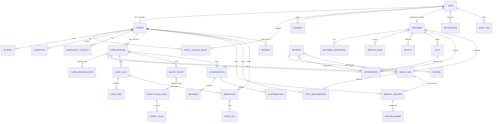

# 04 — Domain Model

Implemented as bounded modules inside the `services/api` modular monolith (Drizzle ORM schema + migrations; PostgreSQL in prod, PGlite in dev/test). Wire shapes live in `docs/api/API_CONTRACT.md`. This file defines the **entities, relationships, invariants and provenance rules** behind them.

## 1. Bounded modules

| Module | Owns entities | Depends on |
|---|---|---|
| identity | User, Session/RefreshToken, OtpRequest, Device | audit |
| consent | Consent (ledger), ConsentCatalog | identity |
| patients | Patient, Allergy, Condition, EmergencyContact, FamilyAccessGrant | identity, consent |
| episodes | CareEpisode, CareEpisodeEvent | patients, audit |
| providers | Provider, ProviderCredential, ServiceZone, Facility, Specialty, Availability/Slot | identity |
| appointments | Appointment, Slot reservation | episodes, providers, payments |
| home-visits | HomeVisit, HomeVisitTimeline, VisitObservation | episodes, providers, payments, safety |
| records | MedicalRecord, RecordFile (object storage), RecordShare, VitalMeasurement | patients, storage, ai |
| care-plans | CarePlan, CareTask, Medication, DoseLog, FollowUp | episodes |
| ai | Conversation, Message, Intake, AIInteraction, KnowledgeSource, KnowledgeChunk | safety, patients, consent |
| safety | SafetyRulePack, SafetyRule, SafetyEvaluation (trace), SafetyEvent | episodes, audit |
| notifications | Notification, NotificationPreference, DeliveryAttempt | identity |
| payments | Payment, Refund, WebhookEvent, SettlementLedgerEntry (hook) | — |
| ops | Incident (complaint/incident/clinical_incident), IncidentNote | all (read) |
| extras (flagged) | PharmacyProduct, PharmacyOrder, MoodEntry, WoundCase, DeviceConnection, FallEvent, SosEvent | patients, safety, records |
| platform | AuditLog, FeatureFlag, IdempotencyRecord, OutboxJob | — |

Modules talk through service interfaces and domain events (in-process; see ADR-001), never through each other's tables.

## 2. ER diagram (core)

(`Payment.refId` is polymorphic over appointment, home_visit and pharmacy_order. The diagram shows the two P0 purposes.)

## 3. Entity catalogue

| Entity | Key fields (beyond id/createdAt/updatedAt) | Invariants |
|---|---|---|
| User | phone (unique, E.164), name, email, roles[], language, status, lastLoginAt | Phone is the identity; roles only changed by super_admin |
| Patient | userId (nullable for dependents), managedByUserId, name, dob, gender, bloodGroup, heightCm, weightKg, relation | A self patient exists for every user; dependents have `managedByUserId` |
| FamilyAccessGrant | patientId, granteeUserId, relation, permissions[], status, revokedAt | Unique active grant per (patient, grantee); revocation is permanent (re-grant creates a new row) |
| Consent | userId, purpose, version, scope, status, grantedAt, revokedAt | Ledger: rows are never updated except to revoke; a new version → a new row |
| Allergy / Condition | patientId, substance/name, reaction, severity/since, **source** | `source` required |
| EmergencyContact | patientId, name, phone, relation | — |
| Provider | userId, type (doctor/nurse/technician/intern/physiotherapist), qualification, specialty, registrationNumber, verificationStatus, credentialExpiresAt, zones[], capabilities[], onDuty, languages, fees | Discoverable/matchable only when `verified` and `credentialExpiresAt > now` |
| ProviderCredential | providerId, kind, number, issuer, evidenceRef, verifiedBy, verifiedAt, expiresAt | "Verified" only after ops review of evidence, never self-declared |
| ServiceZone | name, city, pincodes[] | — |
| Facility | name, type, address, lat/lng, services[], emergency24x7, verified | — |
| Slot | doctorId, startAt, endAt, status | **Unique (slotId) reservation**; transactional conditional update available→held/booked |
| CareEpisode | patientId, title, concern, status, priority, ownerUserId, initiatedByUserId, nextAction, followUpDueAt, resolution | Transitions only via the domain state machine (`05_CARE_EPISODE_SPEC.md`) |
| CareEpisodeEvent | episodeId, type, description, actorUserId, actorRole, data(jsonb) | **Append-only** (no UPDATE/DELETE; enforced by repository + DB grant/trigger in prod) |
| Appointment | patientId, doctorId, slotId, mode, status, reason, fee, careEpisodeId, clinicianNotes, outcome | Always linked to an episode (auto-created if omitted) |
| HomeVisit | patientId, serviceCode, address, preferred window, status, providerId, visitCode (hashed at rest recommended), etaMinutes, observations, summary, escalation, careEpisodeId | Provider must be verified at assignment **and** at every action |
| VitalMeasurement | patientId, type, value, unit, measuredAt, **source**, recordedByUserId, homeVisitId? | No clinical interpretation unless approved rules exist |
| MedicalRecord | patientId, type, title, recordDate, **source**, uploadedByUserId, storageKey, fileName, mimeType, sizeBytes, sha256, aiSummary(separate columns) | **Original file immutable**; replace = new record + link |
| RecordShare | recordId, doctorId, expiresAt, revokedAt | Access denied after `expiresAt` |
| CarePlan | careEpisodeId, patientId, doctorId, status, summary, instructions, followUpDueAt, supersedesPlanId | Only one `active` plan per episode; clinician-authored only |
| CareTask | carePlanId, patientId, type, title, dueAt, owner, status, completedAt, completedByUserId, completionNote | Status machine in `06_CARE_PLAN_SPEC.md` |
| Medication | patientId, carePlanId?, name, dose, frequency, times[], start/end, instructions, **source**, prescribedByUserId, active | The system never changes a medication on its own |
| DoseLog | medicationId, scheduledAt, status, loggedAt, loggedByUserId | Unique (medicationId, scheduledAt) |
| Conversation / Message | patientId, actingUserId, status, careEpisodeId, intake(jsonb) / role, kind, text, quickReplies, routing, safety | — |
| AIInteraction | useCase, userId, patientId, conversationId, model, provider, promptVersion, policyVersion, rulePackVersion, safetyLevel, sourceIds[], latencyMs, tokens, fallbackUsed, inputRef, outputRef | Raw text is stored encrypted and separated from metadata; the admin list shows metadata only |
| SafetyRulePack / SafetyRule | version, status, active, approvedBy, approverRegistration, approvedAt / rule JSON per the contract | Only one active pack per environment; prod refuses `fixture_unapproved` |
| SafetyEvent | patientId, careEpisodeId, level, source, rules[], rulePackVersion, status, assignedToUserId, ackAt, resolvedAt, note | Never deleted |
| KnowledgeSource / Chunk | title, owner, version, status, effectiveDate, expiresAt, content / sourceId, text, keywords | Retrieval only from `approved` and in-date sources |
| Notification | userId, category, title, body, critical, read, deepLink, channel deliveries | Lock-screen body is generic |
| Payment / Refund | purpose, refId, patientId, amount (₹ int), status, gateway, gatewayOrderId, refundedAmount / paymentId, amount, reason, status | Idempotent on the gateway event id |
| WebhookEvent | gateway, eventId (unique), signatureValid, payload hash, processedAt | Duplicate eventId → no-op 200 |
| Incident | type, title, description, severity, status, patientId, refType/refId, notes[] | — |
| AuditLog | actorId, actorRole, action, entityType, entityId, patientId, outcome, ip, correlationId, purpose, before/after hash, metadata | **Append-only, tamper-evident** (hash chain recommended) |
| IdempotencyRecord | userId, key, route, requestHash, responseStatus, responseBody, expiresAt | Same key + different body → `IDEMPOTENCY_MISMATCH` |
| FeatureFlag | key, enabled, description, cohort | — |

## 4. State machines

| Entity | States | Spec |
|---|---|---|
| CareEpisode | NEW, INTAKE, AWAITING_CARE, CARE_SCHEDULED, UNDER_CARE, FOLLOW_UP, RESOLVED + ESCALATED, EMERGENCY, TRANSFERRED, CANCELLED | `05_CARE_EPISODE_SPEC.md` |
| Appointment | pending_payment → confirmed → in_progress → completed; cancelled; no_show | Contract §7 |
| HomeVisit | requested → assigned → accepted → en_route → arrived → in_progress → completed; unassigned, cancelled, escalated (can still complete) | Contract §8 |
| Provider verification | pending → verified; rejected; suspended; expired (derived from the date) | Blueprint §27 (the full onboarding pipeline Applied → Documents pending → Under review is ops process in the MVP) |
| CarePlan | active → completed; active → superseded | `06_CARE_PLAN_SPEC.md` |
| CareTask | open → done; open → overdue → done; open/overdue → cancelled | `06_CARE_PLAN_SPEC.md` |
| Payment | pending → succeeded → partially_refunded → refunded; pending → failed | Contract §13 |
| SafetyEvent | open → acknowledged → resolved | Contract §16 |
| SafetyRulePack | draft → approved → retired; fixture_unapproved (test only) | `07_CLINICAL_SAFETY_INTERFACE.md` |
| KnowledgeSource | draft → approved → deprecated | `08_AI_POLICY.md` |
| Incident | open → investigating → resolved → closed | Contract §18 |
| FallEvent | awaiting_response → closed_safe / escalated | Contract §15 |
| WoundCase | retake_required / pending_clinician_review → reviewed | Contract §15 |

## 5. Provenance rules

Provenance values: `patient_entered`, `clinician_verified`, `home_visit`, `imported`, `ai_extracted`, `device`. Intake fields use `user`, `record`, `model_extraction`.

1. **Every clinical data item carries a source.** Allergies, conditions, vitals, medications, records and timeline items. There is no default; a missing source is a validation error.
2. **Provenance is set by the server from the calling context, never from the client.** `POST /vitals` from the patient app → `patient_entered`; the provider visit vitals endpoint → `home_visit`; wearable sync → `device`; the care-plan medication → `clinician_verified`; record upload by patient → `patient_entered`; home-visit summary → `home_visit`.
3. **AI never overwrites.** AI-extracted values and summaries are stored in separate fields/rows marked `ai_extracted`, with model and timestamp. Originals (files, clinician notes, patient-entered values) are never mutated by AI.
4. **Upgrading trust is an explicit, audited action.** Only a clinician can mark an item `clinician_verified`. That creates a new version (or a verification stamp) and keeps the prior value in history.
5. **Original documents are immutable.** Files are content-addressed (sha256). Correction means a new record plus a `supersedes` link; restriction hides the record from grantees and doctors but keeps it for audit and legal retention.
6. **Intake provenance:** each `IntakeField` records `source` and `confidence`. The model may only fill a field from text the user actually said (`user`/`model_extraction`) or from an authorized record (`record`). Values without support stay `null` and are listed in `missingFields`. Adversarial tests check this (`12_TEST_STRATEGY.md`).
7. **Display:** every UI that shows clinical data shows the provenance chip. The clinician portal distinguishes AI content (lavender panel, "AI-generated · not a diagnosis") from verified data.
8. **Device data** (wearables) is supportive only. It is never used alone to trigger diagnosis-like messaging. Safety rules may use it only if governance approves a rule that references it **[REQUIRES CLINICAL GOVERNANCE]**.

## 6. Cross-cutting fields and conventions

- UUID primary keys; `created_at`/`updated_at` UTC; soft-delete only where retention requires it (`deleted_at`), never on audit or event tables.
- Money in integer rupees at the API. Payments are stored in paise internally in the gateway adapter.
- Every mutation within a transaction writes: domain row(s) + episode event (if episode-linked) + audit log + outbox job (notifications/analytics). This is the transactional outbox, which the in-process worker drains now and BullMQ drains later.
- Migrations are forward-only with a written rollback note (`13_DEPLOYMENT.md`).
