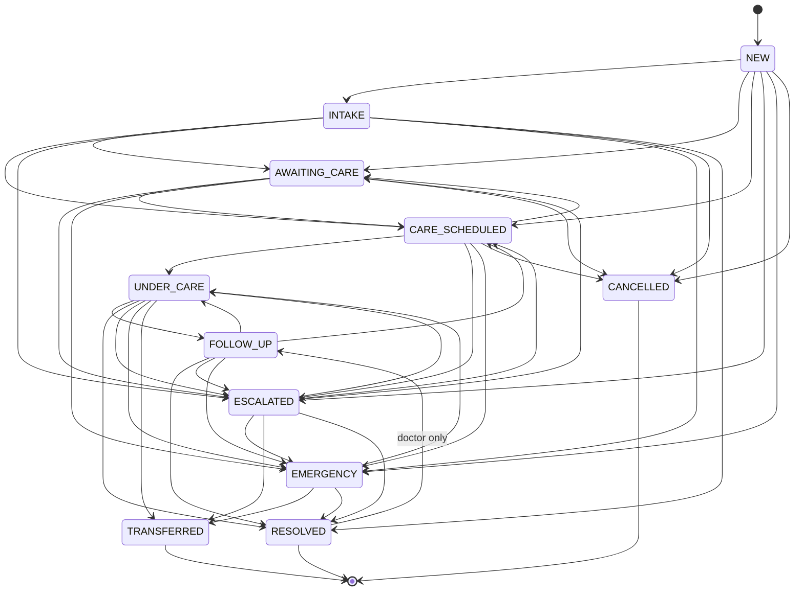

# 05 — Care Episode Specification

The Care Episode is the backbone object. **One health concern, from initiation through resolution.** Every AI conversation, appointment, home visit, vital, record, care plan, task, follow-up and safety event for that concern references the same episode (`careEpisodeId`).

## 1. Fields

See `CareEpisode` / `CareEpisodeDetail` in `API_CONTRACT.md` §5. Domain fields not exposed in v1: `initiatedByUserId` (patient / caregiver / provider / staff), `followUpDueAt`, `resolution` (`resolved` | `ongoing_care` | `transferred` | `cancelled`), `summary`.

| Field | Rule |
|---|---|
| `title` | Short label, for example "Dizziness: Father". Set at creation; defaults to the appointment/visit reason on auto-creation. |
| `concern` | Free-text concern in the user's words. Never replaced by AI text. |
| `status` | Only changed through the transition guard (§3). |
| `priority` | `routine` / `urgent` / `emergency`. Raised automatically by safety results; **never lowered automatically**. Only a doctor or coordinator lowers it, with a reason (audited). |
| `ownerUserId` | The accountable human (§5). Null only in NEW/INTAKE. |
| `nextAction` | Human-readable pending step, shown on the patient home screen and ops lists. |

## 2. Lifecycle

Happy path: `NEW → INTAKE → AWAITING_CARE → CARE_SCHEDULED → UNDER_CARE → FOLLOW_UP → RESOLVED`.
Exceptional states: `ESCALATED`, `EMERGENCY`, `TRANSFERRED`, `CANCELLED`. History is always preserved.

## 3. Transition table (exactly as in the contract)

| From | Allowed to |
|---|---|
| NEW | INTAKE, AWAITING_CARE, CARE_SCHEDULED, ESCALATED, EMERGENCY, CANCELLED |
| INTAKE | AWAITING_CARE, CARE_SCHEDULED, ESCALATED, EMERGENCY, CANCELLED, RESOLVED |
| AWAITING_CARE | CARE_SCHEDULED, ESCALATED, EMERGENCY, CANCELLED |
| CARE_SCHEDULED | UNDER_CARE, AWAITING_CARE, ESCALATED, EMERGENCY, CANCELLED |
| UNDER_CARE | FOLLOW_UP, RESOLVED, ESCALATED, EMERGENCY, TRANSFERRED |
| FOLLOW_UP | RESOLVED, CARE_SCHEDULED, UNDER_CARE, ESCALATED, EMERGENCY |
| ESCALATED | AWAITING_CARE, CARE_SCHEDULED, UNDER_CARE, EMERGENCY, TRANSFERRED, RESOLVED |
| EMERGENCY | TRANSFERRED, UNDER_CARE, RESOLVED |
| RESOLVED | FOLLOW_UP (**role `doctor` only**); otherwise terminal |
| CANCELLED | terminal |
| TRANSFERRED | terminal |

Anything else → `409 INVALID_STATE_TRANSITION` with `details: { from, to, allowed: [...] }`. The guard lives in the **domain layer** (a pure function `canTransition(from, to, actorRoles)`), not in UI or route handlers. Unit tests cover all 121 (from, to) pairs: 41 allowed plus role checks, and the rest rejected.

Every transition requires a `reason` and atomically writes: the status update, an `EpisodeEvent{type: "status_changed", data: {from, to, reason}}` and an `AuditLog` entry.

## 4. System-initiated transitions

| Trigger | Target | Notes |
|---|---|---|
| AI conversation started for an episode | NEW → INTAKE | Event `ai_intake_started` |
| Intake complete, routing `book_doctor`/`home_visit` | → AWAITING_CARE | Event `ai_intake_completed` with routing |
| Intake complete, routing `information` only | may → RESOLVED (INTAKE → RESOLVED) when the user confirms nothing further is needed | Never automatic when the safety level ≥ `urgent` |
| Safety level `urgent` (AI, home visit, mood) | → ESCALATED; priority → urgent | Creates a `SafetyEvent` |
| Safety level `emergency` / SOS / home-visit emergency escalation / unanswered fall event | → EMERGENCY; priority → emergency | Creates a `SafetyEvent`; notifies `receive_alerts` family and emergency contacts |
| Appointment payment succeeded / home visit confirmed | → CARE_SCHEDULED | Event `appointment_booked` / `home_visit_requested` |
| Clinician starts consult | → UNDER_CARE | `/clinician/appointments/:id/start` |
| Home visit completed | CARE_SCHEDULED → UNDER_CARE (awaiting doctor review), or UNDER_CARE → FOLLOW_UP | Event `home_visit_completed`; `visit_summary` record created |
| Care plan created with a follow-up | → FOLLOW_UP | `followUpDueAt` set |
| Consult outcome `resolved` | → RESOLVED | — |
| Consult outcome `refer` | → TRANSFERRED | Resolution `transferred` |
| All plan tasks done and the follow-up completed | stays FOLLOW_UP; ops/doctor prompt to resolve | Resolution is a human decision (§6) |

**Rule for system triggers:** a system trigger whose target is not allowed from the current state **does not force the transition**. It appends an event (for example `appointment_booked`) and leaves the status unchanged. **Exception:** safety-driven transitions to EMERGENCY/ESCALATED. If they are not allowed (for example from a terminal state), the system creates a **new linked episode** in EMERGENCY/ESCALATED so the escalation is never lost.

## 5. Ownership and responsibility

| State | Accountable owner (`ownerUserId`) | Who acts next |
|---|---|---|
| NEW / INTAKE | none (patient-driven) | Patient/family with `manage_care` |
| AWAITING_CARE | Care coordinator for the zone (auto-assigned round-robin; ops can reassign) | Patient books, or the coordinator reaches out |
| CARE_SCHEDULED | Coordinator until the consult starts | Doctor / provider |
| UNDER_CARE | Treating doctor | Doctor |
| FOLLOW_UP | Treating doctor (clinical); coordinator (task chasing) | Patient/family completes tasks |
| ESCALATED | Assigned doctor on escalation duty; coordinator until acknowledged | Clinician acknowledges within the SLA **[REQUIRES CLINICAL GOVERNANCE]** for the SLA value |
| EMERGENCY | Coordinator/ops on duty (non-clinical follow-through: check contact, log outcome) + clinician review | Patient is directed to 108; the platform does not dispatch |
| RESOLVED / CANCELLED / TRANSFERRED | Last owner (for audit) | — |

The escalation-ownership matrix (which named clinician holds escalation duty, and when) is a clinical governance deliverable **[REQUIRES CLINICAL GOVERNANCE]**.

## 6. Resolution criteria (hooks)

An episode may move to RESOLVED when **a doctor** (or a coordinator for non-clinical episodes such as information-only or cancelled-by-user) confirms one of:
- consult outcome `resolved` with no open care plan;
- the care plan is completed (all non-cancelled tasks done) and the follow-up is completed or waived by the doctor;
- information-only routing with safety level `none`, confirmed by the user.

Resolution hooks are configuration so governance can tighten them. Automatic resolution is **off** by default.

## 7. Event types

`created`, `status_changed`, `ai_intake_started`, `ai_intake_completed`, `safety_triggered`, `escalated`, `appointment_booked`, `appointment_rescheduled`, `appointment_cancelled`, `consult_started`, `consult_completed`, `home_visit_requested`, `home_visit_assigned`, `home_visit_completed`, `home_visit_escalated`, `record_added`, `care_plan_created`, `care_plan_superseded`, `task_completed`, `task_overdue`, `follow_up_due`, `note_added`, `owner_changed`, `priority_changed`, `payment_succeeded`, `payment_refunded`, `sos_triggered`.

Rules: events are **append-only**; `data` contains IDs and codes, not free-text PHI beyond what the event needs; `actorName`/`actorRole` show "System" for automated events. The patient timeline shows a filtered, patient-friendly subset.

## 8. Idempotency and concurrency

- `POST /care-episodes` requires `Idempotency-Key`. Replay returns the original 201 body.
- Transitions use optimistic concurrency (`WHERE id = ? AND status = :from`). A lost race returns `INVALID_STATE_TRANSITION` with the current status.
- Auto-created episodes (from appointment or visit creation) are created inside the same transaction as the parent resource.

## 9. Visibility

Patient/self/manager: full. Grantee: requires `view_records`. Doctor: related episodes. Provider: none (sees only the visit). Ops: all episodes (`/ops/care-episodes`), with patient name and status but not clinical documents.
