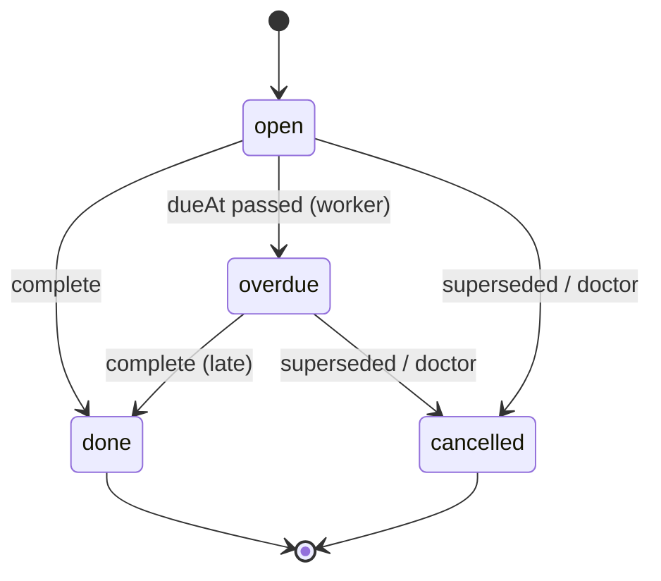

# 06 — Care Plan, Tasks and Follow-Up Specification

Purpose: the workflow continues **after** the consultation instead of ending at the prescription. We measure care-plan completion, not only consultation completion.

## 1. Principles

1. **Clinician-authored.** Only role `doctor` creates a Care Plan (`POST /care-plans`). Clinical instructions never come from AI. An AI summary may be shown beside the authoring form and marked advisory, but it is never auto-copied into the plan.
2. **One active plan per episode.** A new plan sets the previous `active` plan to `superseded`. Its open tasks are cancelled with reason `superseded`, and its medications become inactive unless the new plan re-lists them.
3. **Every plan action becomes a trackable Care Task**, with an owner, a due date where relevant, and a status.
4. **The system never changes medication on its own.** Patient-entered medications (`POST /medications`) carry source `patient_entered`. Plan medications carry `clinician_verified` and `prescribedByName`.
5. **Prescription workflow** (e-prescription format, authorized prescribers, drug schedules) is **[REQUIRES LEGAL REVIEW]** and **[REQUIRES CLINICAL GOVERNANCE]**. In the MVP the plan's medication list is a care-coordination list, not a legal prescription document.

## 2. Care Plan content

| Section | API field | Notes |
|---|---|---|
| Summary / clinical assessment | `summary` | Clinician text; shown to patient and family (`view_records`) |
| Instructions (lifestyle, restrictions, symptoms to watch) | `instructions` | "Symptoms to watch" wording is the clinician's own. The platform does not generate warning signs. |
| Tasks | `tasks[]` | Types: `medication`, `test`, `follow_up`, `lifestyle`, `monitoring`, `general` |
| Medications | `medications[]` | name, dose, frequency, times, start/end, instructions |
| Follow-up | `followUp: { afterDays, mode }` | Computes `followUpDueAt` and creates a `follow_up` task |
| Responsible provider | `doctorId` | The author |

## 3. Care Task model

| Field | Rule |
|---|---|
| `owner` | `patient`, `caregiver` (any grantee with `manage_care`), or `provider` (home-care follow-up) |
| `dueAt` | Optional. Tasks without a due date never go overdue. |
| `status` | `open → done`; `open → overdue` (worker, when `dueAt` passes) `→ done`; `open/overdue → cancelled` (superseded or doctor cancels) |
| Completion evidence | `completedAt`, `completedByName`, optional `note`; test tasks may link an uploaded `MedicalRecord` (P1: `evidenceRecordId`) |

Task completion writes an `EpisodeEvent{task_completed}` and an audit entry. It notifies the doctor only for `test` and `follow_up` tasks (configurable).

## 4. Medications and reminders

- `Medication.times[]` (HH:mm, patient's local timezone Asia/Kolkata by default) expands to daily scheduled doses between `startDate` and `endDate`.
- Dose status: `pending` (future or within the grace window), `taken`/`skipped` (logged via `POST /medications/:id/doses`), `missed` (worker marks it after the grace window, default 2h, configurable).
- `GET /reminders/today` merges medication doses, due tasks, today's appointments, home visits and follow-ups into one list for the Home tab.
- Missed-dose alerts to family with `receive_alerts` are **off by default** and user-configurable. Frequency limits prevent alert fatigue.
- Refill reminders are P1.
- The platform never recommends skipping, doubling or changing a dose. A dose-related question in the AI assistant is routed to "ask your doctor" and the medication-question SOP **[REQUIRES CLINICAL GOVERNANCE]**.

## 5. Follow-up

1. The plan's `followUp.afterDays` sets `followUpDueAt = plan.createdAt + afterDays`, and the episode moves to FOLLOW_UP.
2. A `follow_up` task is created with owner `patient`. At T-2 days and T-0 a reminder is sent and a booking deep link (`mode`: video / in_clinic / home_visit) is offered, pre-linked to the same episode.
3. Booking the follow-up moves the episode FOLLOW_UP → CARE_SCHEDULED (allowed) and completes the task when the appointment is completed.
4. An overdue follow-up (not booked 48h after the due date) appears in `/ops/overdue-tasks`. The coordinator contacts the family (L2), with the outcome logged as an incident note or task note.
5. Resolution follows `05_CARE_EPISODE_SPEC.md` §6.

## 6. Metrics (instrumented)

| Metric | Numerator | Denominator | Source event |
|---|---|---|---|
| Task completion rate | tasks `done` (by due date + 24h) | tasks with a due date in period, not cancelled | `task_completed`, worker overdue |
| Follow-up completion rate | follow-up tasks done | follow-up tasks due in period | `follow_up` tasks |
| Medication adherence | doses `taken` | doses scheduled (taken + skipped + missed) | DoseLog |
| Care-plan completion | plans `completed` | plans created in cohort | CarePlan status |

Dashboard owner: product lead (continuity), with clinical lead review.

## 7. Edge cases

| Case | Behavior |
|---|---|
| Doctor creates a plan for an episode in a terminal state | 409 unless the doctor first reopens RESOLVED → FOLLOW_UP |
| Patient deletes a plan medication | Not allowed. The patient may mark it "stopped by me", which creates a note and doctor notification (P1); the record stays. |
| Grantee without `manage_care` tries to complete a task | 403 |
| Superseded plan task completed offline later | Rejected with 409. The client shows "This plan was updated by your doctor." |
| Timezone/DST | India has no DST; all times are stored in UTC and rendered in Asia/Kolkata |
