# 07 — Clinical Safety Interface

> **NON-NEGOTIABLE (Build Map §12).** Engineering builds the safety-engine *software*. Engineering and AI do **not** write the medical red-flag rules, thresholds, emergency criteria or scope-of-practice policy. Those come from the Clinical Governance Board as versioned, approved data. **No rule content in this repository is clinically approved.**

## 1. Purpose and position in the pipeline

The deterministic safety engine evaluates structured inputs against the **active approved rule pack**. It runs **before** the LLM reply is produced and **independently** of it:

```
intake + authorized context ──► Safety Engine (deterministic, versioned) ──► SafetyResult
                                                                   │
LLM reply ◄── may only ADD caution ────────────────────────────────┘ (level can never be lowered)
```

Sources evaluated: AI intake (`ai_intake`), home-visit vitals/escalation (`home_visit`), mood entries (`mood`), fall events (`fall`), SOS (`sos`).

## 2. Software contract

### 2.1 Rule schema (as in `API_CONTRACT.md` §19)

```ts
SafetyRule = {
  id: string, title: string, description: string,
  when: {
    anyKeywords?: string[],   // any matched (normalized, multilingual synonyms supplied in the pack)
    allKeywords?: string[],   // all matched
    minSeverity?: number,     // intake severity 0-10 >=
    vital?: { type: VitalType, op: "lt" | "gt", value: number },
    ageGte?: number
  },                          // all present conditions must hold (AND)
  level: "routine" | "urgent" | "emergency",
  action: "show_emergency" | "escalate_clinician" | "suggest_doctor" | "suggest_home_visit"
}
SafetyRulePack = { id, version, status: "draft"|"fixture_unapproved"|"approved"|"retired",
                   active, approvedBy, approverRegistration, approvedAt, rules: SafetyRule[] }
```

Schema extensions (for example duration, combinations of vitals, negation, per-language lexicons) are added **only when governance asks for them**, as a new schema version with migration and tests.

### 2.2 Engine interface

```ts
interface SafetyEngine {
  evaluate(input: SafetyInput): SafetyEvaluation;      // pure, synchronous, no network
  activePack(): { version: string; status: PackStatus } | null;
}
SafetyInput = { source, text?: string, language, intake?: Intake, vitals?: VitalMeasurement[],
                patientAge?: number, moodScore?: number }
SafetyEvaluation = SafetyResult & {
  trace: [{ ruleId, matched: boolean, matchedOn: string[] }],  // every rule evaluated
  inputsUsed: string[],                                       // field names, not values
  evaluatedAt: string, engineVersion: string
}
```

- **Aggregation:** the result level is the **maximum** level over triggered rules (`none < routine < urgent < emergency`). Actions are the union.
- **Determinism:** same pack + same input gives the same output. No randomness, clock or network. Text normalization (case, Unicode NFC, whitespace, configured transliteration/synonyms from the pack) is part of the versioned engine.
- **Result contract to callers:** `SafetyResult { level, triggeredRules[{ruleId,title,action}], rulePackVersion, rulePackStatus }`.

### 2.3 Non-override guarantees (tested)

| Guarantee | Enforcement |
|---|---|
| The LLM cannot lower a level | The orchestrator takes `max(engineLevel, policyCheckLevel)`. The LLM output schema has no field that can set the level. |
| Emergency replaces the chat | If level = `emergency`, the assistant text is replaced by the **fixed emergency template** (localized, call 108, SOS button, notify family). The LLM reply is discarded (it is logged). |
| Urgent always escalates | Level `urgent` creates a `SafetyEvent` (status `open`) and moves the episode to ESCALATED. The UI shows a safety-alert bubble with a doctor CTA. |
| Routing is controlled | For level ≥ `urgent`, `Routing.action` is set by the engine's action, not by the LLM. |
| Every evaluation is logged | `AIInteraction.rulePackVersion`, `safetyLevel`; `SafetyEvent.rules`; the trace is stored with the interaction |

## 3. Fail-safe behavior

| Condition | Behavior |
|---|---|
| No active pack (dev/test) | `/ready` reports `safetyRules: "fixture"` or a failure. AI endpoints return the fallback: "I can't safely assess this right now. Please consult a doctor; if this is an emergency call 108." Routing: `book_doctor`. **Production: the AI assistant is disabled (flag-forced) until an approved pack is active.** |
| Active pack is `fixture_unapproved` in **production** | **The API refuses to start** (boot check), and activation via the admin API returns 409. |
| Engine exception on an input | Treat as `urgent` (fail closed): create a `SafetyEvent` with source-specific note `engine_error`, and route to a doctor. Alert on-call engineering. |
| Pack load/parse/validation error | Keep the previous active pack in memory. If none exists, apply the no-active-pack behavior above. Alert. |
| AI provider down / kill switch | The safety engine **still runs** on the user's text and intake-so-far. An emergency template still shows. The fallback reply is used for everything else. |
| Clock/timezone issues | Not applicable (engine is time-independent) |

## 4. The fixture-pack warning

The repository ships `fixture-0.1` (status `fixture_unapproved`, active only in dev/test). It exists **only** to exercise the software (matching, aggregation, escalation, audit and UI paths).

> ⚠️ **FIXTURE RULES ARE NOT MEDICAL CONTENT.** They were not written or reviewed by clinicians. They may contain placeholder keywords that happen to resemble symptoms, but they must not be read as, copied into, or used as the basis for a clinical rule set. Any UI running with a fixture pack displays a persistent banner: **"TEST SAFETY RULES — NOT CLINICALLY APPROVED."** Every `SafetyResult` carries `rulePackStatus: "fixture_unapproved"`, and every AI interaction logs it.

Required controls: (a) a production boot check that refuses a `fixture_unapproved` active pack, and (b) a release-pipeline check that fails any production config referencing a fixture pack. Both are launch gates. Their implementation status is tracked in `docs/KNOWN_LIMITATIONS.md`.

## 5. Approval and activation workflow

```mermaid
flowchart LR
  A[Clinical Governance drafts rules<br/>from approved SOPs] --> B[super_admin uploads<br/>POST /admin/safety-rule-packs<br/>status=draft]
  B --> C[Automated validation<br/>schema, duplicate ids, level/action consistency]
  C --> D[Replay against AI evaluation set<br/>+ regression diff vs current pack]
  D --> E[Clinical reviewer signs off<br/>out-of-band record]
  E --> F[POST .../approve<br/>approverName + approverRegistration]
  F --> G[Staging activation + smoke tests]
  G --> H[Production activation<br/>POST .../activate]
  H --> I[Previous pack -> retired]
```



| Step | Owner | Evidence |
|---|---|---|
| Rule authoring from SOPs (fever, headache, dizziness, BP, glucose, respiratory, abdominal, elderly weakness, medication questions, post-discharge, wounds, falls; high-risk pathways for chest pain, severe breathlessness, altered consciousness/fainting; generic emergency) | Medical director + governance committee **[REQUIRES CLINICAL GOVERNANCE]** | SOP library, red-flag catalogue |
| Multilingual keyword lists (en/hi/te, transliterated/colloquial) | Clinician + language reviewer **[REQUIRES CLINICAL GOVERNANCE]** | Glossary sign-off |
| Validation and replay | Engineering (automated) | CI report attached to the pack |
| False-negative/false-positive review of the replay | Clinical reviewer | Evaluation report (`docs/AI_EVALUATION.md`) |
| Approval | Named approver with medical registration number | `approvedBy`, `approverRegistration`, `approvedAt` + signed approval log kept outside the system |
| Activation | super_admin, after approval, change window, on-call clinician aware | Audit log `safety_pack.activated` |
| Rollback | super_admin re-activates the previous approved pack | Audit log; incident if triggered by a safety miss |

Rules:
- An `approved` pack is **immutable**. Changes mean a new version.
- Activation requires status `approved` (prod) and is audited with the actor and correlation ID.
- Two-person rule recommended: the uploader ≠ the approver ≠ the activator (open decision D-Q10).
- Emergency change path (a rule found to be missing after an incident): same workflow with an expedited clinical sign-off, never bypassed.

## 6. Scope-of-practice and capability configuration

Provider capabilities (`vitals_check`, `sample_collection`, `elderly_care`, `post_report_consult`) and which provider types may hold them are **configuration** maintained by ops from the governance-approved **Provider Scope-of-Service Matrix** **[REQUIRES CLINICAL GOVERNANCE]** **[REQUIRES LEGAL REVIEW]**. The Blueprint's draft matrix (for example "Diagnose: doctor only; Prescribe: RMP as legally permitted; Change medicines: RMP only") is a planning input, **not approved policy**.

Vitals captured on home visits are **not interpreted clinically** by the platform unless an approved rule references them. Without approved vital rules, a provider escalation is a manual decision by the provider under the visit SOP.

## 7. Admin visibility

- `/ready` → `checks.safetyRules: "ok" | "fixture"`.
- `/admin/safety-rule-packs` lists version, status, active flag, approver, rule count and rules.
- The web admin shows the active pack version on every AI-related screen. The clinician portal shows `rulePackVersion` on each safety event.
- Metrics: triggers per rule per day, emergency count, engine errors, time-to-acknowledge.

## 8. What engineering must never do

- Add, edit or "improve" rule content in code or seed data for production.
- Let an LLM generate or tune rules.
- Add a code path where LLM output sets `SafetyResult.level` or suppresses a `SafetyEvent`.
- Silence the fixture banner or relabel a fixture pack as approved.
