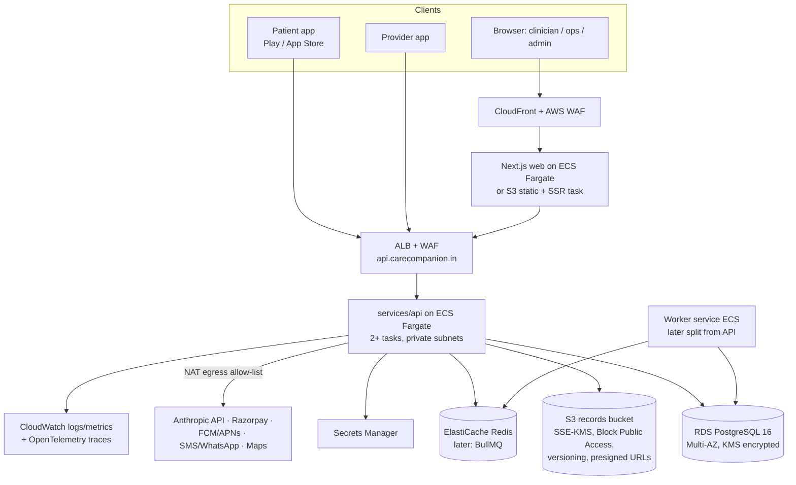

# 13 — Deployment

The operational procedure lives in `docs/runbooks/DEPLOYMENT_RUNBOOK.md` (§3 = first deploy, §7 = rollback). This file defines environments, the AWS architecture, secrets, observability and the release process.

**Status:** the infrastructure is written as Terraform in `infra/terraform` (validated with `terraform validate` and a mocked-provider `terraform test`) and the pipelines exist (`.github/workflows/ci.yml`, `deploy.yml`, `mobile-release.yml`). **Nothing is provisioned yet**: the founder must supply an AWS account, a domain, an ACM certificate, vendor keys and GitHub settings (runbook §3.0), then follow the runbook.

| Artifact | Path |
|---|---|
| API image (multi-stage, non-root, migrations at boot) | `services/api/Dockerfile` |
| Web image (Next.js standalone; NEXT_PUBLIC_* + CSP baked at build, so one image per env) | `apps/web/Dockerfile` |
| Local production-like stack (postgres 16, MinIO, ClamAV, Redis, api, web, seed profile) | `docker-compose.yml` |
| Terraform (VPC, RDS, S3, ECR, ECS, ALB, WAF, Redis, Secrets, alarms, OIDC role) | `infra/terraform` (+ `bootstrap/` for the state bucket) |
| Deploy pipeline | `.github/workflows/deploy.yml` → `deploy-environment.yml` |
| Mobile release pipeline | `.github/workflows/mobile-release.yml` |
| Load tests | `tests/load/k6-journey.js`, `tests/load/smoke.mjs` |
| Store submission guide | `docs/STORE_SUBMISSION.md` |

## 1. Environments

| Env | Purpose | Database | AI | Payments | Safety pack | Data |
|---|---|---|---|---|---|---|
| local | Developer machine | PGlite (embedded, file or in-memory) | offline provider by default; Claude if `ANTHROPIC_API_KEY` set | mock | `fixture-0.1` | seed |
| test/CI | GitHub Actions | PGlite in-memory | offline provider | mock | fixture + in-test packs | seed |
| staging | Pre-prod, pilot rehearsal, pen test | RDS PostgreSQL (small, Multi-AZ optional) | Claude (staging key) | Razorpay test mode | Candidate approved pack (or fixture with banner) | synthetic only |
| production | Controlled Hyderabad pilot | RDS PostgreSQL Multi-AZ | Claude (prod key, zero-retention terms) | Razorpay live | **Approved pack only** (boot check) | real (cohort-gated) |

Production-only invariants: `NODE_ENV=production`; no `devOtp`; `/payments/:id/confirm-mock` disabled; the fixture pack is refused; P1 flags off unless approved; staff MFA enforced (once implemented); pilot cohort gating via feature-flag `cohort`.

## 2. Target AWS architecture (ap-south-1, Mumbai)

Data residency in India is the default for all health data. **[REQUIRES LEGAL REVIEW]** covers any cross-border processing (for example the LLM API).

| Component | Choice | Notes |
|---|---|---|
| Network | VPC with 2 AZs (as built; a third AZ is a later option); public subnets (ALB, NAT), private app subnets, isolated DB subnets with no internet route; S3 gateway endpoint | Security groups: ALB → api/web only; api/worker → RDS 5432, Redis 6379, ClamAV 3310 only |
| API | ECS Fargate service, Node 24 container, min 2 tasks (0.5 vCPU, 1 GB), CPU target-tracking autoscaling (60%, max 6) | Stateless; ALB health check `/api/v1/health` (`/ready` is 503 until an approved rule pack is active, so it is a smoke check, not the LB check); read-only root filesystem |
| Worker | Same image, separate 1-task service with `WORKER_ENABLED=true`; API tasks run `WORKER_ENABLED=false`. A PostgreSQL advisory lock (`WORKER_LOCK_KEY`) elects a single job leader | Overdue tasks, missed doses, SLA breach, fall timeout, notifications, outbox |
| Web | Next.js 15 standalone container on Fargate behind the same ALB (host-based rule for the portal domain). CloudFront in front is optional later | WAF managed rules, rate-based rules |
| Malware scan | `clamav/clamav` Fargate service (1 vCPU, 4 GB), private DNS `clamav.carecompanion-<env>.internal:3310` via Cloud Map → `CLAMAV_HOST` | Required in production (the API refuses the no-op scanner) |
| Database | RDS PostgreSQL 16, Multi-AZ toggle (on in production), gp3 with storage autoscaling, KMS CMK, automated backups **14 days** + PITR, deletion protection + final snapshot, Performance Insights (KMS), `rds.force_ssl=1`, master password managed by RDS in Secrets Manager | App connects as `cc_app` (runbook §3.4); later: `audit_append` (INSERT only on audit/events), `readonly` |
| Object storage | S3 `cc-prod-records` with SSE-KMS (CMK), Block Public Access, versioning, Object Lock (governance) for audit archive, lifecycle to IA/Glacier | Only presigned GET URLs (≤ 5 min) after the API authz check; malware scan on upload (GuardDuty Malware Protection for S3 or ClamAV Lambda) before `hasFile=true` |
| Secrets | AWS Secrets Manager `carecompanion/<env>/api/<NAME>`, created empty by Terraform (`api_secret_names`), values put out-of-band: `DATABASE_URL`, `JWT_SECRET`, `PAYMENT_WEBHOOK_SECRET`, `RAZORPAY_KEY_SECRET`, `RAZORPAY_WEBHOOK_SECRET`, `MSG91_AUTH_KEY`, `MFA_ENCRYPTION_KEY`, `VIDEO_ROOM_SECRET`, `METRICS_TOKEN`, `ANTHROPIC_API_KEY` (+ optional `FCM_PRIVATE_KEY`, `JITSI_APP_SECRET`) | Injected as ECS secrets by the execution role; never in images, tfvars or Terraform state |
| Cache | ElastiCache Redis 7 (TLS + at-rest encryption), `REDIS_URL=rediss://…` | Shared rate-limit counters; BullMQ later |
| IAM | API/worker task role = records bucket + its KMS key only; web/ClamAV tasks have no permissions; GitHub deploy role via OIDC limited to ECR push, task-definition registration, service update and the migration `RunTask` | No long-lived AWS keys anywhere |
| Keys | KMS CMKs per data class (db, records, audit); annual rotation | Key policy limits decrypt to task roles |
| Edge security | AWS WAF on the ALB: IP reputation, Common rule set (body-size rule in COUNT so 15 MB uploads work), Known bad inputs, SQLi, rate limits (3000 req/5 min/IP overall, 100 req/5 min/IP on `/api/v1/auth/otp/*`); ALB TLS policy `ELBSecurityPolicy-TLS13-1-2-2021-06`, HTTP→HTTPS redirect; Shield Standard | Tune limits after pilot traffic is known |
| Observability | CloudWatch Logs (30-day retention, pino JSON, PHI-redacted), Container Insights; alarms → SNS topic (email): API 5xx rate > 2%, ALB 5xx, API p95 > 1.5 s, unhealthy/no healthy hosts (api, web), ECS CPU > 85%, RDS free storage < 10 GiB, RDS CPU > 80%. OpenTelemetry later | Dashboards per SLO (§4) |
| Audit | CloudTrail (org), GuardDuty, Security Hub, AWS Config | — |
| DNS/TLS | ACM certificate (founder-provided ARN); optional Route 53 alias records (`create_route53_records`); host rules: `api.<domain>` → API, portal domain(s) → web, anything else → 404 | HSTS (web security headers) |
| Registry | ECR per env (`carecompanion-<env>-api`/`-web`), immutable tags, scan on push, KMS, keep 50 images | Rollback = previous image/task definition |
| Email | Amazon SES (ap-south-1) | Transactional only |

Cost-conscious pilot sizing: API 2× (0.5 vCPU, 1 GB), web 1–2×, RDS `db.t4g.medium` Multi-AZ, Redis deferred until BullMQ.

## 3. Configuration and secrets

- Config is validated at boot with zod. Missing or invalid values stop the process (fail fast).
- Representative variables (authoritative list: `services/api/.env.example`): `NODE_ENV`, `PORT`, `DATABASE_URL` (prod) / PGlite data dir (dev), `JWT_*` keys and TTLs, `OTP_PROVIDER`, `AI_PROVIDER` (`anthropic`|`offline`), `ANTHROPIC_API_KEY`, `AI_MODEL_*`, `PAYMENT_GATEWAY` (`mock`|`razorpay`), `PAYMENT_WEBHOOK_SECRET`, `STORAGE_DRIVER` (`local`|`s3`), `S3_BUCKET`, `KMS_KEY_ID`, `VISIT_ASSIGN_SLA_MIN` (default 30), `FALL_RESPONSE_TIMEOUT_SEC`, `CORS_ORIGINS`.
- Secret rotation: DB creds 30 days (automatic), JWT signing keys 90 days with dual-key validation (`kid`), webhook secret on gateway rotation, AI key 90 days. Record each rotation in the change log.

## 4. Observability and SLOs (candidate values; confirm in Phase 25)

| SLI | SLO | Alert |
|---|---|---|
| API availability (non-5xx) | 99.5% monthly (pilot) | burn-rate 2%/1h |
| Auth OTP verify success latency p95 | < 500 ms | > 1 s for 10 min |
| Booking success (excl. 4xx) | 99.5% | > 1% 5xx over 15 min |
| Emergency template path p95 | < 1 s, 99.9% | any failure pages |
| Safety event → acknowledgement median | ≤ SLA set by governance **[REQUIRES CLINICAL GOVERNANCE]** | open event older than the SLA pages the on-call coordinator |
| Visit assignment within `VISIT_ASSIGN_SLA_MIN` | ≥ 95% | breach count > 0 → ops dashboard; > 3/hour pages |
| AI fallback rate | < 5% | > 20% over 15 min |
| Notification delivery (critical) | 99% within 60 s | queue age > 5 min |
| Worker/outbox lag | < 60 s | > 5 min |

Logging rules: structured JSON; correlation ID on every line; redaction of `authorization`, `phone`, `name`, `text`, `concern`, `notes`, `summary`, `otp`, `address` and file contents; no request bodies at info level.

## 5. CI/CD

| Stage | Trigger | Actions |
|---|---|---|
| CI | PR / push to main | `ci.yml`: api, web, flutter (typecheck, lint, test, build), `npm audit --audit-level=high` (non-blocking), docker build of both images without push (+ non-root check), `docker compose config`, terraform fmt/validate/test |
| Deploy staging | tag `v*` (or manual) | `deploy.yml` → `deploy-environment.yml`: OIDC → build + push `api:<sha>` and `web:<sha>-<env>-<cfg>` to ECR → register task definitions from the latest Terraform revision → one-off migration task `node dist/db/migrate.js` → update api/worker/web → wait for stable → verify no circuit-breaker rollback → smoke (`/health`, `/ready` db, `/config/public`, portal `/login`) |
| Deploy production | same tag, after staging succeeds, **approval** in GitHub Environment `production` (required reviewers: tech lead + product/ops; tags only) | Same steps; rolling update with minimum healthy 100% and automatic rollback; watch the dashboards for 30 min |
| Rollback | manual | Redeploy the previous task definition ARNs (listed in the job summary) or re-run Deploy for the previous tag. Migrations are expand/contract so the previous version runs on the new schema. Runbook §7. |

Load testing (targets from §4): `tests/load/k6-journey.js` (login → doctors → slots → AI message → reminders; thresholds p95 < 500 ms for non-AI calls, AI p95 < 10 s, errors < 1%) and the dependency-free `node tests/load/smoke.mjs <apiBase>` (autocannon when installed). Staging only.

Authentication to AWS from GitHub Actions uses OIDC (no long-lived keys). Migrations are forward-only and **expand → migrate → contract** across two releases. Every migration PR includes a rollback note.

## 6. Mobile release

| Step | Patient app / Provider app |
|---|---|
| Build | `mobile-release.yml`: signed AABs for both apps (upload keys from base64 secrets, `--dart-define` from repo variables, obfuscated with split debug info), artifacts uploaded, optional Play internal-track upload (`r0adkll/upload-google-play`, only when `PLAY_SERVICE_ACCOUNT_JSON` exists); iOS job skeleton off by default. Flavors are a later option |
| Signing | Android upload key in Play App Signing; iOS certificates via App Store Connect API key in CI secrets |
| Distribution (pilot) | Play Console **closed testing track** + TestFlight for the pilot cohort; the provider app is distributed via Play closed track / MDM to credentialed providers |
| Store compliance | Play health-app declaration, Data safety form, health-connect permissions (only when wearables ship); App Store privacy nutrition labels, medical-app review notes **[REQUIRES LEGAL REVIEW]** |
| Rollout | Staged rollout 10% → 50% → 100% after the pilot; forced-update endpoint for breaking API changes |
| Crash/perf | Firebase Crashlytics (no PHI in logs or breadcrumbs) |

## 7. Backup and DR

RDS automated backups (14 days, `db_backup_retention_days`) + PITR; weekly snapshot copied to a second region **only if legal review permits** (otherwise a second AZ plus a same-region vault). S3 versioning + replication policy per legal review. Targets: **RPO ≤ 15 min, RTO ≤ 4 h** (pilot). A quarterly restore drill is documented in `DEPLOYMENT_RUNBOOK.md`.
